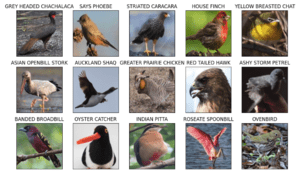
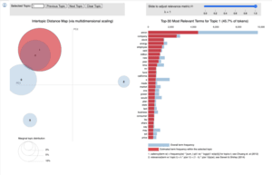

# Data Scientist

#### Technical Skills: Python, SQL, Numpy, Pandas, sklearn, Machine Learning, Neural Networks, Statistical Analysis, Data Cleaning & Modeling, Big Data, Tensorflow, Tableau

## Projects

### Duck, Duck, Choose: CNN for Bird Classification
[Web app](https://duck-duck-choose.streamlit.app/) | [Github repo](https://github.com/LarissaHuang/capstone_project)

This project uses a custom transfer learning model leveraging the pre-trained weights of EfficientNetB0 to classify bird species across 75 bird species. 

### Fraud Detection in Python
[GitHub repo](https://github.com/LarissaHuang/Fraud-Detection-Python)

This project tackles fraud detection by employing a range of machine learning strategies across both supervised and unsupervised learning domains, alongside text mining.

## Education
- Data Science Diploma | BrainStation (April 2024)
- New Media Design & Web Development Diploma | BCIT (2018)
- Bachelor of Arts in Creative Writing | University of Wales (2016)

### Work Experience
[Resume](https://github.com/LarissaHuang/LarissaHuang.github.io/blob/main/Larissa_Huang_Data_Science_Resume.pdf)

